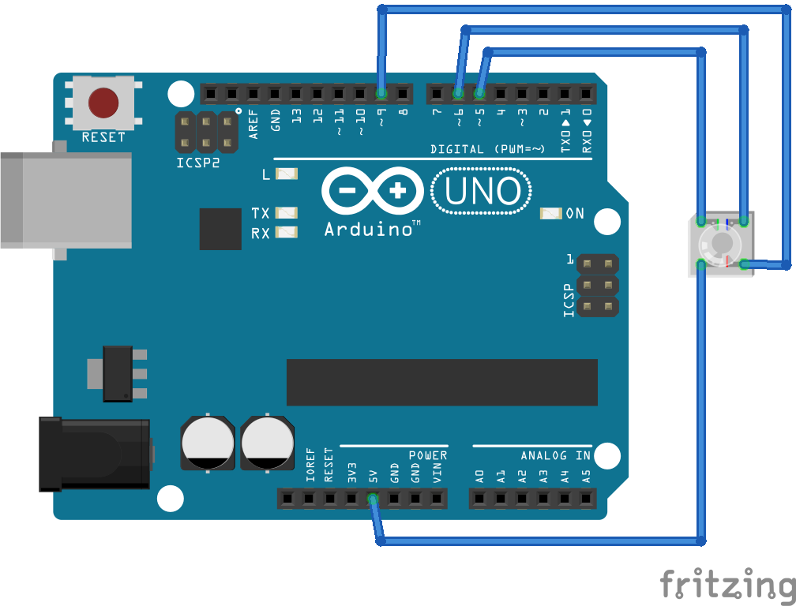

#	RGB

## Kód
[rgb.ino](../../../examples/rgb/rgb.ino)
[rgb_pwm.ino](../../../examples/rgb_pwm/rgb_pwm.ino)

## Motivace a cíle

  - Ukázat, jak se pracuje s RGB LED.
  - Vysvětlit míchání barev
  - PWM

## Teorie
  - Rozsvěcení nikoli přes HIGH proti zemi, ale přes LOW proti Vcc
  - RGB – míchání barevných světel. Každá barva se skládá ze tří základních světel
  - Pro pokročilejší: zmínit rozdíl mezi „mícháním světel“ a „mícháním barevných pigmentů“
  - [PWM](https://cs.wikipedia.org/wiki/Pulzn%C4%9B_%C5%A1%C3%AD%C5%99kov%C3%A1_modulace)

##	Použité funkce
  - analogWrite
  
## Zapojení

 
## Cvičení
  - Ukázka plynulých změn barvy světla
  - Změnit přírůstky/úbytky pro PWM. (Student by si měl všimnout, že od určité hranice svítí LED plně. Vysvětlit důvod: minimální napětí nutné pro rozsvícení)

## Pro lektora
  - Volitelně: vysvětlit důvody spínání proti Vcc
